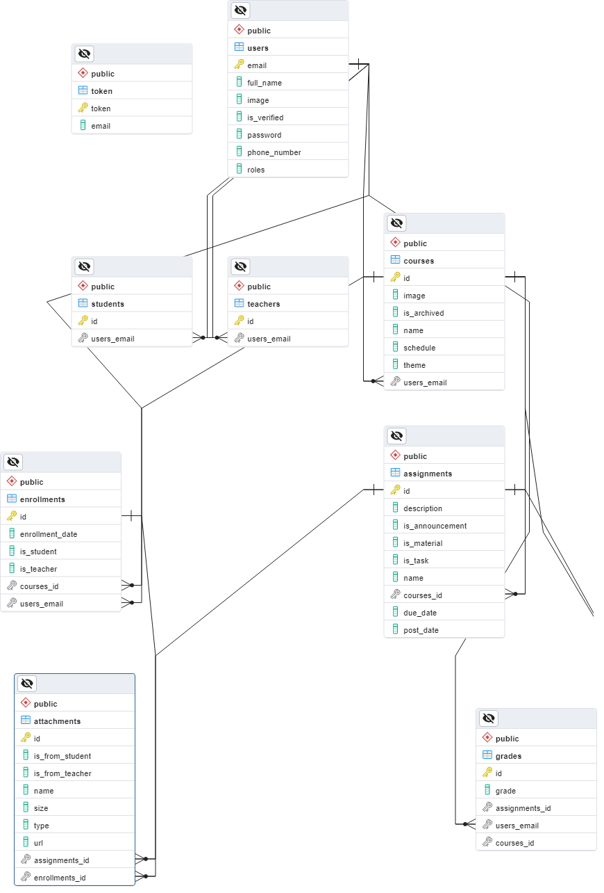

# Gosmart Classroom

Gosmart Classroom: Masa depan pendidikan yang lebih cerah

> Gosmart Classroom adalah aplikasi pendidikan yang dirancang untuk memberikan pengalaman belajar yang menyenangkan, fleksibel, dan berkualitas. Dengan Gosmart Classroom, pengguna dapat belajar dari mana saja dan kapan saja, sesuai dengan waktu dan kebutuhan mereka.

> Project ini masih dalam pengembangan.

## Fitur

Untuk **Student** (`user`):
- Mengakses kursus yang sudah terdaftar
- Mengirim attachment ke assignment tertentu

Untuk **Teacher** (`user`):
- Mengakses dan Mengelola kursus yang sudah terdaftar
- Membuat kursus
- Membuat assignment
- Memberi nilai kepada student
- Mengirim attachment ke assignment tertentu

Untuk **Admin** (`admin`):

- Kelola teacher
- Kelola student
- Kelola kursus
- Kelola user
- Mengirim email verifikasi user yang registrasi
- Mengirim email ketika teacher mengirimkan assignment

Semua pengguna:

- Edit profil

## Diagram ER

## Tech stack

- Frontend: React, MUI, Axios
- Backend: Java Spring Boot
- Basis data: PostgreSQL